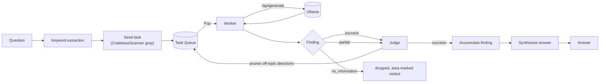
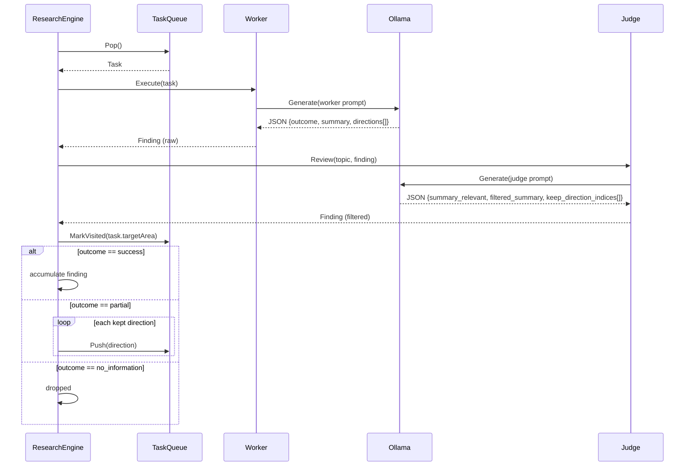
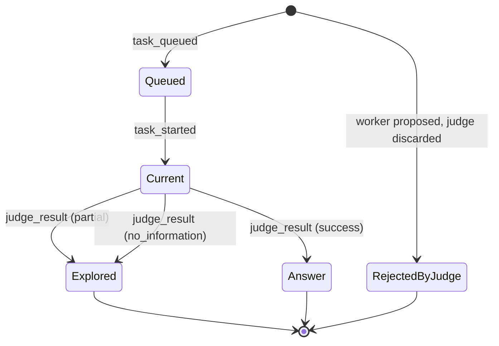
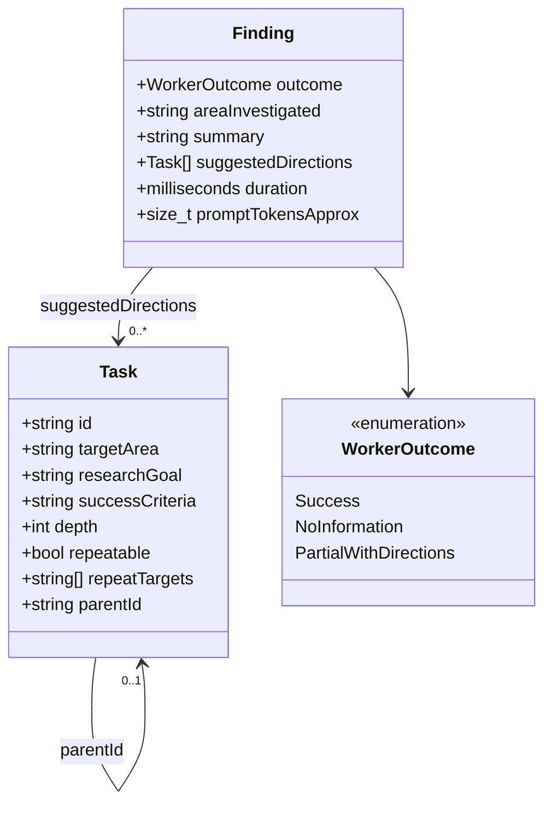
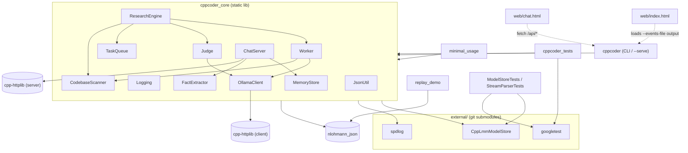
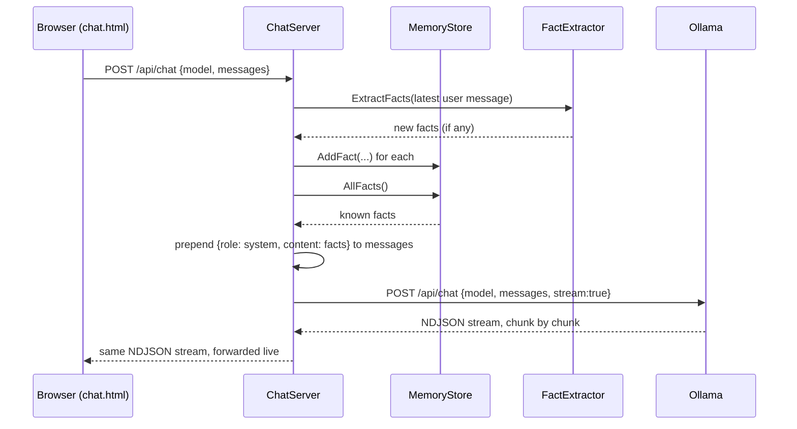

# CppLocalLlmCodeAssist

A C++23 toolkit for working with a small local LLM (via [Ollama](https://ollama.com))
against a large codebase, in two modes:

- **Research mode** (`cppcoder --question ... --codebase ...`): a
  sustained-research engine that implements the worker/judge/task-queue
  architecture described in *"Building a Code Assistant, Part 2: A
  Sustained Research Engine"*. Rather than dumping the whole repository
  into a single context window, the question is broken into a sequence
  of bounded research tasks that the model works through one at a time,
  with a second model pass acting as a judge that prunes anything
  off-topic before it re-enters the queue.
- **Chat mode** (`cppcoder --serve`): a plain, "Claude for Desktop"-style
  web chat UI backed by the same Ollama instance, with swappable models
  and a small persisted-facts memory. See [Chat mode](#chat-mode) below.

Every subfolder has its own README with more detail: [`include/cppcoder/`](include/cppcoder/README.md),
[`src/`](src/README.md), [`tests/`](tests/README.md), [`examples/`](examples/README.md),
[`web/`](web/README.md).

## Research mode

A question is answered incrementally:

1. **Keyword extraction** pulls identifier-like terms out of the question.
2. Those keywords **seed an initial task** by grepping the codebase for
   candidate files.
3. A **worker** investigates one area at a time, bounded to a token
   budget (~120K by default, matching the empirical usable context
   window of small local models), and reports one of three outcomes.
4. A **judge** reviews the worker's findings and follow-up directions,
   discarding anything unrelated to the original question.
5. Surviving directions **re-enter the queue**; areas are never
   revisited. The loop continues until the queue drains, an iteration
   cap is hit, or a wall-clock budget (default 90 minutes) runs out.
6. Once at least one task succeeds, the accumulated findings are
   **synthesized into a final answer**.

## Architecture



### One loop iteration



### Task / Finding lifecycle

Mirrors the states shown in the web UI (`web/index.html`):



### Core types



### Module / build-target graph



## Repository layout

```
CppCoder/
├── include/cppcoder/     Public headers -- see include/cppcoder/README.md
├── src/                  Implementation + main.cpp -- see src/README.md
├── tests/                105 GoogleTest cases -- see tests/README.md
├── examples/             replay_demo, minimal_usage -- see examples/README.md
├── web/                  index.html + chat.html -- see web/README.md
└── external/             git submodules: CppLmmModelStore, spdlog, googletest
```

## Quick start

`t.ps1` is the main entry point (PowerShell 7+, cross-platform):
initializes submodules if needed, configures, builds, and runs all 105
tests in one command.

```
./t.ps1                                              # init + build + test
./t.ps1 -Clean -Jobs 8                                # full rebuild, 8 jobs
./t.ps1 -Question "How does the judge prune?" -Codebase .   # build, then research
./t.ps1 -SkipBuild -OpenWeb                           # just open the task-graph UI
./t.ps1 -Serve                                        # build, then start the chat UI
```

`r.ps1` is a thin, dedicated shortcut for the common case of just wanting
the chat UI running -- it forwards to `t.ps1 -Serve`:

```
./r.ps1                          # build (if needed) + open http://127.0.0.1:8765/chat.html
./r.ps1 -SkipBuild                # reuse the existing build, just serve
./r.ps1 -Clean -ServePort 9000    # full rebuild, serve on a different port
```

Run `Get-Help ./t.ps1 -Full` (or `./r.ps1 -Full`) for every parameter
(`-EventsFile`, `-LogLevel`, `-Model`, `-SkipTests`, `-ServeHost`, `-ServePort`, ...).

> **Windows note:** LLVM 21.1.1 has a real bug that OOMs parsing MSVC's
> C++23 STL headers on trivial files -- confirmed on both `clang++` and
> `clang-cl` driver modes, so switching driver mode alone doesn't fix it.
> If you hit this, downgrade LLVM to a mature release (18.1.8 is a safe
> bet): `winget uninstall --id LLVM.LLVM` then
> `winget install --id LLVM.LLVM --version 18.1.8 -e`, reopen your
> terminal, confirm with `clang --version`. `t.ps1` defaults to
> `-Compiler clang-cl` on Windows either way (still clang, still Ninja).
> If you'd rather drop clang entirely, `-Compiler msvc` switches to
> `cl.exe` + Ninja (auto-imports the VS developer environment so you
> don't need a separate dev shell).

## Build

Requires CMake >= 3.24 and a C++23 compiler.

```
cmake -B build -S .
cmake --build build -j$(nproc)
```

All dependencies are handled automatically: `nlohmann_json` and
`cpp-httplib` are fetched via CMake FetchContent if not already present
on the system (`find_package` is tried first, so an existing
`nlohmann-json3-dev`/vcpkg/conan install is used instead of re-fetching).
`external/CppLmmModelStore`, `external/googletest`, and `external/spdlog`
are git submodules:

```
git submodule update --init --recursive
```

| Submodule | Purpose |
|---|---|
| `external/CppLmmModelStore` | Shared local-model path resolution (zero-duplication convention used across this author's other projects) |
| `external/spdlog` | All runtime logging, in this project and in CppLmmModelStore |
| `external/googletest` | Test suite, shared between `tests/` and CppLmmModelStore's own tests |

`spdlog` and `googletest` are each added to the CMake project exactly
once, before `external/CppLmmModelStore`; the submodule's own
`CMakeLists.txt` checks `if(NOT TARGET spdlog::spdlog)` / `if(NOT TARGET
GTest::gtest_main)` first and reuses whatever the parent already
provided instead of vendoring a second copy.

## Run: research mode

```
ollama pull qwen2.5-coder:7b
./build/src/cppcoder --question "How does X work?" --codebase /path/to/repo
```

| Option | Default | Description |
|---|---|---|
| `--question <text>` | *(required)* | Question to research |
| `--codebase <path>` | *(required)* | Root of the codebase to investigate |
| `--model <name>` | `qwen2.5-coder:7b` | Ollama model tag |
| `--host <host>` | `localhost` | Ollama host |
| `--port <port>` | `11434` | Ollama port |
| `--max-minutes <n>` | `90` | Wall-clock budget |
| `--max-iterations <n>` | `200` | Max task-loop iterations |
| `--token-budget <n>` | `120000` | Approx tokens per task |
| `--events-file <path>` | *(none)* | Write JSON-Lines engine events (consumed by `web/index.html` and `examples/replay_demo`) |
| `--log-level <level>` | `info` | `trace\|debug\|info\|warn\|err\|critical\|off` |
| `--log-file <path>` | *(none)* | Also write logs to this file |

## Chat mode

`cppcoder --serve` (or `./r.ps1`) starts a plain conversational chat UI
instead of a research run: a local HTTP server (`ChatServer`) serves
`web/chat.html` and proxies every turn straight through to Ollama's own
`/api/chat`, streaming the reply back token-by-token. No research engine
involved -- this is a general-purpose local chat client with a model
switcher, not a codebase-research tool.



Facts mentioned in chat ("my name is...", "I am NN yo", "your name
is...") are auto-detected by `FactExtractor` and persisted by
`MemoryStore` to `~/.models/memory.json` (or `$DEEPSEEK_MODEL_HOME/memory.json`,
or `$CPPCODER_MEMORY_FILE`), then re-injected as a system message on
every subsequent turn -- so the assistant remembers them across
conversations and across model switches. The chat page has a "🧠 Memory"
panel to view, add, or forget facts by hand (`GET`/`POST`/`DELETE
/api/memory`).

| Option | Default | Description |
|---|---|---|
| `--serve` | *(off)* | Start the chat server instead of researching |
| `--serve-host <addr>` | `127.0.0.1` | Address to bind the chat server to |
| `--serve-port <port>` | `8765` | Port to bind the chat server to |
| `--web-root <path>` | auto-detect `./web` | Directory to serve as the chat UI |
| `--memory-file <path>` | `~/.models/memory.json` | Facts file to persist/read |
| `--model <name>` | `qwen2.5-coder:7b` | Default Ollama model tag (switchable per-conversation from the UI) |
| `--host` / `--port` | `localhost` / `11434` | Ollama connection used to service `/api/models` and `/api/chat` |

See [web/README.md](web/README.md) for the frontend side of this.

## Logging

All runtime logging goes through [spdlog](https://github.com/gabime/spdlog)
(colored console sink + optional file sink), not raw `std::cerr`:

```
./build/src/cppcoder --question "..." --codebase . --log-level debug --log-file /tmp/run.log
```

CLI usage/argument errors and the final answer report still go to plain
stderr/stdout, since those are the tool's actual output rather than
diagnostic logging.

## Test

105 tests in `cppcoder_tests` (this repo's own suite) plus 3 more inside
the `external/CppLmmModelStore` submodule (`ModelStoreTests`,
`StreamParserTests`) -- 108 total, all pure/offline. The network-facing
parts are tested via pure functions -- `Worker::ParseWorkerResponse`,
`Judge::ApplyJudgeResponse`, `FallbackKeywords`, `ResearchEngine::SeedInitialTasks`
-- so none of it needs a running Ollama instance:

```
cd build && ctest --output-on-failure
```

| Test file | Cases | Covers |
|---|---|---|
| `JsonUtilTests.cpp` | 16 | Brace/bracket extraction from model output |
| `TypesTests.cpp` | 8 | `Task` defaults, `EstimateTokens` |
| `TaskQueueTests.cpp` | 13 | Dedup, visited tracking, FIFO order, repeatable tasks |
| `CodebaseScannerTests.cpp` | 15 | Recursive scan, token budgeting, `.git`/`build` exclusion, keyword search |
| `WorkerTests.cpp` | 13 | Worker JSON response parsing, malformed/prose-wrapped input |
| `JudgeTests.cpp` | 12 | Direction pruning, summary filtering, outcome downgrade |
| `ResearchEngineTests.cpp` | 11 | Keyword fallback, seed-task construction |
| `MemoryStoreTests.cpp` | 9 | Persistence, case-insensitive dedup, remove, default-path resolution |
| `FactExtractorTests.cpp` | 8 | Name/age extraction patterns, multi-fact messages, no-match cases |

See [tests/README.md](tests/README.md) for more detail.

## Examples

`examples/` builds two small executables:

- **`replay_demo`** replays a JSON-Lines event log (the same schema
  `--events-file` writes, and the same schema `web/index.html` consumes)
  directly in the terminal, either one event at a time or auto-played at
  any speed:

  ```
  ./build/examples/replay_demo --events examples/demo_events.jsonl --step
  ./build/examples/replay_demo --events examples/demo_events.jsonl --speed 4
  ./build/examples/replay_demo --events /tmp/real_run.jsonl --speed 0.5
  ```

  `examples/demo_events.jsonl` is a recorded example run (the PDF
  encryption-key scenario) so this works with no engine or Ollama
  instance required.

- **`minimal_usage`** exercises the library's network-free pieces
  directly (`FallbackKeywords`, `CodebaseScanner`, `TaskQueue`) as a
  getting-started reference:

  ```
  ./build/examples/minimal_usage /path/to/repo
  ```

## Web UI

`web/` has two self-contained, dependency-free pages -- see
[web/README.md](web/README.md) for full detail on both:

- **`index.html`** visualizes a research run as a task graph (question →
  keyword probe → worker/judge chain → answer), matching the
  architecture above. **Play demo** replays a scripted example with no
  engine required; **Load events file** replays the JSON-Lines output of
  a real `--events-file` run.
- **`chat.html`** is the chat-mode frontend: model switcher, streaming
  replies, and the memory panel described in [Chat mode](#chat-mode)
  above. Served by `cppcoder --serve`, not meant to be opened directly
  as a file (it calls back to `/api/*` on the same origin).

## License

MIT. See [LICENSE](LICENSE).
