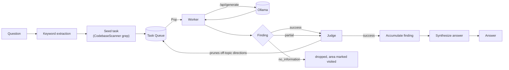
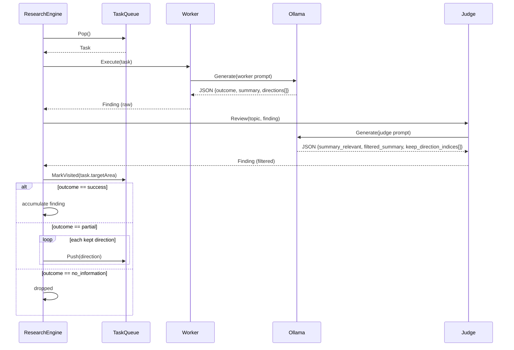
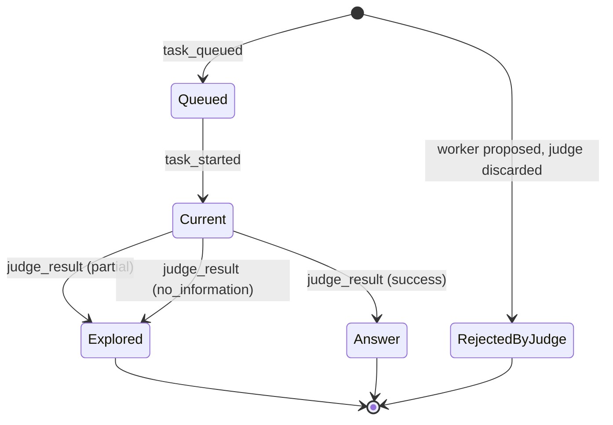
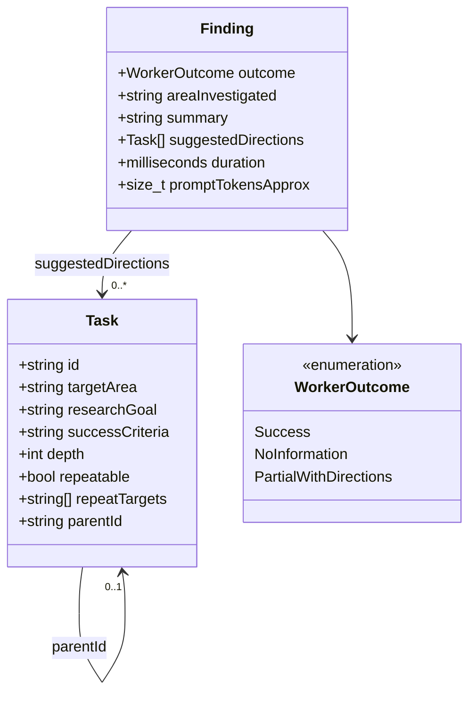
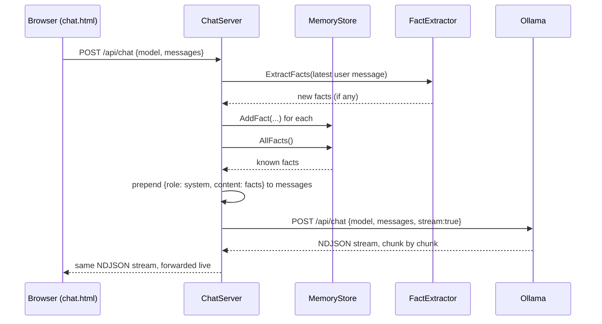
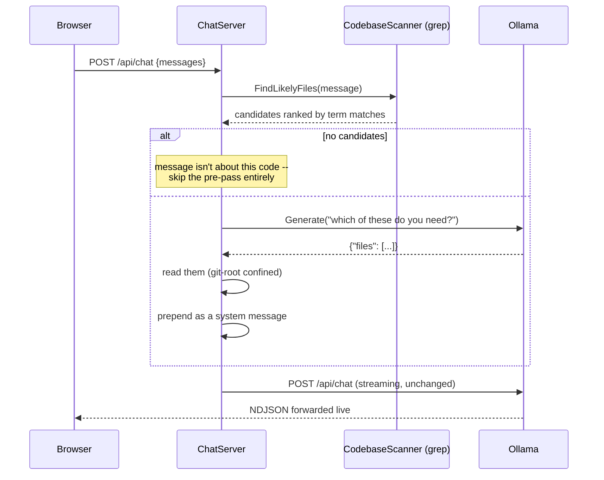

# CppLocalLlmCodeAssist

A C++23 toolkit for working with a small local LLM (via [Ollama](https://ollama.com))
against a large codebase, in three modes:

- **Research mode** (`cppcoder --question ... --codebase ...`): a
  sustained-research engine that implements the worker/judge/task-queue
  architecture described in *"Building a Code Assistant, Part 2: A
  Sustained Research Engine"*. Rather than dumping the whole repository
  into a single context window, the question is broken into a sequence
  of bounded research tasks that the model works through one at a time,
  with a second model pass acting as a judge that prunes anything
  off-topic before it re-enters the queue.
- **Edit mode** (`cppcoder --task ... --codebase ... [--apply]`): the
  same keyword-seeded task-queue architecture as research mode, but
  driving an editor instead of a researcher -- the model proposes full
  replacement content for the files a task touches, which are printed
  for review (the default) or written to disk with `--apply`. See
  [Edit mode](#edit-mode) below.
- **Chat mode** (`cppcoder --serve`): a plain, "Claude for Desktop"-style
  web chat UI backed by the same Ollama instance, with swappable models
  and a small persisted-facts memory. See [Chat mode](#chat-mode) below.
- **CLI chat mode** (`cppcoder --cli`): the terminal counterpart to chat
  mode -- a "Claude Code"-style interactive REPL against the same Ollama
  backend, same retrieval pre-pass, remembered facts, and `/pwd` `/ls`
  `/read` `/write` local commands, without a browser or HTTP server in
  the loop. See [Chat mode](#chat-mode) below.

Every subfolder has its own README with more detail: [`include/cppcoder/`](include/cppcoder/README.md),
[`src/`](src/README.md), [`tests/`](tests/README.md), [`examples/`](examples/README.md),
[`web/`](web/README.md).

## Research mode

A question is answered incrementally:

1. **Keyword extraction** pulls identifier-like terms out of the question.
2. Those keywords **seed an initial task** by grepping the codebase for
   candidate files.
3. A **worker** investigates one area at a time, bounded to a token
   budget (~120K by default, matching the empirical usable context
   window of small local models), and reports one of three outcomes.
4. A **judge** reviews the worker's findings and follow-up directions,
   discarding anything unrelated to the original question.
5. Surviving directions **re-enter the queue**; areas are never
   revisited. The loop continues until the queue drains, an iteration
   cap is hit, or a wall-clock budget (default 90 minutes) runs out.
6. Once at least one task succeeds, the accumulated findings are
   **synthesized into a final answer**.

## Architecture


```mermaid
flowchart LR
    Q["Question"] --> KW["Keyword extraction"]
    KW --> Seed["Seed task\n(CodebaseScanner grep)"]
    Seed --> TQ[("Task Queue")]
    TQ -->|Pop| W["Worker"]
    W -->|"/api/generate"| O[("Ollama")]
    O --> W
    W --> F{"Finding"}
    F -->|success| J["Judge"]
    F -->|partial| J
    F -->|no_information| Drop["dropped, area marked visited"]
    J -->|prunes off-topic directions| TQ
    J -->|success| Acc["Accumulate finding"]
    Acc --> Ans["Synthesize answer"]
    Ans --> Out["Answer"]
```

### One loop iteration


```mermaid
sequenceDiagram
    participant E as ResearchEngine
    participant Q as TaskQueue
    participant W as Worker
    participant O as Ollama
    participant J as Judge

    E->>Q: Pop()
    Q-->>E: Task
    E->>W: Execute(task)
    W->>O: Generate(worker prompt)
    O-->>W: JSON {outcome, summary, directions[]}
    W-->>E: Finding (raw)
    E->>J: Review(topic, finding)
    J->>O: Generate(judge prompt)
    O-->>J: JSON {summary_relevant, filtered_summary, keep_direction_indices[]}
    J-->>E: Finding (filtered)
    E->>Q: MarkVisited(task.targetArea)
    alt outcome == success
        E->>E: accumulate finding
    else outcome == partial
        loop each kept direction
            E->>Q: Push(direction)
        end
    else outcome == no_information
        E->>E: dropped
    end
```

### Task / Finding lifecycle

Mirrors the states shown in the web UI (`web/index.html`):


```mermaid
stateDiagram-v2
    [*] --> Queued: task_queued
    Queued --> Current: task_started
    Current --> Explored: judge_result (partial)
    Current --> Explored: judge_result (no_information)
    Current --> Answer: judge_result (success)
    Explored --> [*]
    Answer --> [*]
    [*] --> RejectedByJudge: worker proposed, judge discarded
    RejectedByJudge --> [*]
```

### Core types


```mermaid
classDiagram
    class Task {
        +string id
        +string targetArea
        +string researchGoal
        +string successCriteria
        +int depth
        +bool repeatable
        +string[] repeatTargets
        +string parentId
    }
    class Finding {
        +WorkerOutcome outcome
        +string areaInvestigated
        +string summary
        +Task[] suggestedDirections
        +milliseconds duration
        +size_t promptTokensApprox
    }
    class WorkerOutcome {
        <<enumeration>>
        Success
        NoInformation
        PartialWithDirections
    }
    Finding --> WorkerOutcome
    Finding --> "0..*" Task : suggestedDirections
    Task --> "0..1" Task : parentId
```

### Module / build-target graph


```mermaid
flowchart TD
    subgraph ext["external/ (git submodules)"]
        ModelStore["CppLmmModelStore"]
        Spdlog["spdlog"]
        GTest["googletest"]
    end

    subgraph core["cppcoder_core (static lib)"]
        JsonUtil
        Logging
        OllamaClient
        CodebaseScanner
        Worker
        Judge
        TaskQueue
        ResearchEngine
        Editor
        PatchApplier
        EditEngine
        ChatServer
        ChatCli
        MemoryStore
        FactExtractor
        LocalCommands
        FileRetriever
    end

    Worker --> OllamaClient
    Worker --> CodebaseScanner
    Judge --> OllamaClient
    ResearchEngine --> Worker
    ResearchEngine --> Judge
    ResearchEngine --> TaskQueue
    ResearchEngine --> CodebaseScanner
    Editor --> OllamaClient
    Editor --> CodebaseScanner
    EditEngine --> Editor
    EditEngine --> PatchApplier
    EditEngine --> TaskQueue
    EditEngine --> CodebaseScanner
    ChatServer --> MemoryStore
    ChatServer --> FactExtractor
    ChatServer --> LocalCommands
    ChatServer --> FileRetriever
    ChatCli --> MemoryStore
    ChatCli --> FactExtractor
    ChatCli --> LocalCommands
    ChatCli --> FileRetriever
    FileRetriever --> CodebaseScanner
    FileRetriever --> LocalCommands
    FileRetriever --> OllamaClient
    ChatServer --> HTTPLIB[("cpp-httplib (server)")]
    ChatCli --> HTTPLIB2
    core --> ModelStore
    core --> Spdlog
    core --> NJ[("nlohmann_json")]
    OllamaClient --> HTTPLIB2[("cpp-httplib (client)")]

    CLI["cppcoder (CLI / --serve / --cli / --task)"] --> core
    ReplayDemo["replay_demo"] --> NJ
    MinimalUsage["minimal_usage"] --> core
    Tests["cppcoder_tests"] --> core
    Tests --> GTest
    ModelStoreTests["ModelStoreTests / StreamParserTests"] --> ModelStore
    ModelStoreTests --> GTest

    ChatHtml["web/chat.html"] -.->|"fetch /api/*"| CLI
    IndexHtml["web/index.html"] -.->|"loads --events-file output"| CLI
```

## Repository layout

```
CppCoder/
├── include/cppcoder/     Public headers -- see include/cppcoder/README.md
├── src/                  Implementation + main.cpp -- see src/README.md
├── tests/                205 GoogleTest cases -- see tests/README.md
├── examples/             replay_demo, minimal_usage -- see examples/README.md
├── web/                  index.html + chat.html -- see web/README.md
└── external/             git submodules: CppLmmModelStore, spdlog, googletest, CppProlog
```

## Quick start

`t.ps1` is the main entry point (PowerShell 7+, cross-platform):
initializes submodules if needed, configures, builds, and runs all 205
tests in one command.

```
./t.ps1                                              # init + build + test
./t.ps1 -Clean -Jobs 8                                # full rebuild, 8 jobs
./t.ps1 -Question "How does the judge prune?" -Codebase .   # build, then research
./t.ps1 -Task "Fix the typo in README.md" -Codebase .        # build, then propose an edit (dry-run)
./t.ps1 -Task "Fix the typo in README.md" -Codebase . -Apply  # ...and write it to disk
./t.ps1 -SkipBuild -OpenWeb                           # just open the task-graph UI
./t.ps1 -Serve                                        # build, then start the chat UI
```

`r.ps1` is a thin, dedicated shortcut for the common case of just wanting
the chat UI running -- it forwards to `t.ps1 -Serve`:

```
./r.ps1                          # build (if needed) + open http://127.0.0.1:8765/chat.html
./r.ps1 -SkipBuild                # reuse the existing build, just serve
./r.ps1 -Clean -ServePort 9000    # full rebuild, serve on a different port
```

Run `Get-Help ./t.ps1 -Full` (or `./r.ps1 -Full`) for every parameter
(`-EventsFile`, `-FileRoot`, `-LogLevel`, `-Model`, `-SkipTests`, `-ServeHost`,
`-ServePort`, ...).

> **Windows note:** LLVM 21.1.1 has a real bug that OOMs parsing MSVC's
> C++23 STL headers on trivial files -- confirmed on both `clang++` and
> `clang-cl` driver modes, so switching driver mode alone doesn't fix it.
> If you hit this, downgrade LLVM to a mature release (18.1.8 is a safe
> bet): `winget uninstall --id LLVM.LLVM` then
> `winget install --id LLVM.LLVM --version 18.1.8 -e`, reopen your
> terminal, confirm with `clang --version`. `t.ps1` defaults to
> `-Compiler clang-cl` on Windows either way (still clang, still Ninja).
> If you'd rather drop clang entirely, `-Compiler msvc` switches to
> `cl.exe` + Ninja (auto-imports the VS developer environment so you
> don't need a separate dev shell).

## Build

Requires CMake >= 3.24 and a C++23 compiler.

```
cmake -B build -S .
cmake --build build -j$(nproc)
```

All dependencies are handled automatically: `nlohmann_json` and
`cpp-httplib` are fetched via CMake FetchContent if not already present
on the system (`find_package` is tried first, so an existing
`nlohmann-json3-dev`/vcpkg/conan install is used instead of re-fetching).
`external/CppLmmModelStore`, `external/googletest`, `external/spdlog`,
and `external/CppProlog` are git submodules:

```
git submodule update --init --recursive
```

| Submodule | Purpose |
|---|---|
| `external/CppLmmModelStore` | Shared local-model path resolution (zero-duplication convention used across this author's other projects) |
| `external/spdlog` | All runtime logging, in this project and in CppLmmModelStore |
| `external/googletest` | Test suite, shared between `tests/` and CppLmmModelStore's own tests |
| `external/CppProlog` | [cschladetsch/CppProlog](https://github.com/cschladetsch/CppProlog), a C++23 Prolog interpreter -- vendored for an upcoming feature. Not yet `add_subdirectory()`'d or linked into any target. |

`spdlog` and `googletest` are each added to the CMake project exactly
once, before `external/CppLmmModelStore`; the submodule's own
`CMakeLists.txt` checks `if(NOT TARGET spdlog::spdlog)` / `if(NOT TARGET
GTest::gtest_main)` first and reuses whatever the parent already
provided instead of vendoring a second copy.

## Run: research mode

```
ollama pull qwen2.5-coder:1.5b
./build/src/cppcoder --question "How does X work?" --codebase /path/to/repo
```

| Option | Default | Description |
|---|---|---|
| `--question <text>` | *(required)* | Question to research |
| `--codebase <path>` | *(required)* | Root of the codebase to investigate |
| `--model <name>` | `qwen2.5-coder:1.5b` | Ollama model tag |
| `--host <host>` | `localhost` | Ollama host |
| `--port <port>` | `11434` | Ollama port |
| `--max-minutes <n>` | `90` | Wall-clock budget |
| `--max-iterations <n>` | `200` | Max task-loop iterations |
| `--token-budget <n>` | `120000` | Approx tokens per task |
| `--events-file <path>` | *(none)* | Write JSON-Lines engine events (consumed by `web/index.html` and `examples/replay_demo`) |
| `--log-level <level>` | `info` | `trace\|debug\|info\|warn\|err\|critical\|off` |
| `--log-file <path>` | *(none)* | Also write logs to this file |

## Edit mode

```
ollama pull qwen2.5-coder:1.5b
./build/src/cppcoder --task "Add a doc comment to Frobnicate()" --codebase /path/to/repo
./build/src/cppcoder --task "Add a doc comment to Frobnicate()" --codebase /path/to/repo --apply
```

Edit mode reuses the same keyword-seeded task-queue loop as research
mode (`EditEngine`, mirroring `ResearchEngine`), but drives an `Editor`
instead of a `Worker`/`Judge` pair: the model is asked to return the
**complete new content of each file it changes**, not a diff. That's a
deliberate trade-off -- more tokens per edit, and the model has to
faithfully reproduce untouched parts of larger files -- in exchange for
not needing any diff/patch-matching logic, which is also where a small
local model is most likely to produce output that silently corrupts a
file if trusted blindly.

**Nothing is written to disk unless you pass `--apply`.** Without it,
proposed edits are printed to stdout for review only. With it, each
edit is applied via `PatchApplier` as soon as it's produced (so a
multi-file task sees its own earlier edits when it re-scans later
areas), and the run report lists what was written, rejected (a path
that resolved outside `--codebase`), or hit an I/O error. Run with a
clean git working tree so `--apply` is always trivially revertible --
edit mode doesn't check this for you, the same advisory-only philosophy
`main.cpp` already uses for `IsModelAvailable`/`ModelExists`.

| Option | Default | Description |
|---|---|---|
| `--task <text>` | *(required)* | Change to make |
| `--codebase <path>` | *(required)* | Root of the codebase to change |
| `--apply` | *(off, dry-run)* | Write proposed edits to disk instead of just printing them |
| `--model` / `--host` / `--port` | same as research mode | Ollama connection |
| `--max-minutes` / `--max-iterations` / `--token-budget` | same as research mode | Loop budgets |
| `--events-file <path>` | *(none)* | JSON-Lines events: `task`, `keywords_extracted`, `task_queued`, `task_started`, `edit_result`, `edit_proposed`/`edit_applied`/`edit_rejected`, `complete` |
| `--log-level` / `--log-file` | same as research mode | Logging |

## Chat mode

`cppcoder --serve` (or `./r.ps1`) starts a plain conversational chat UI
instead of a research run: a local HTTP server (`ChatServer`) serves
`web/chat.html` and proxies every turn straight through to Ollama's own
`/api/chat`, streaming the reply back token-by-token. No research engine
involved -- this is a general-purpose local chat client with a model
switcher, not a codebase-research tool.


```mermaid
sequenceDiagram
    participant B as Browser (chat.html)
    participant S as ChatServer
    participant M as MemoryStore
    participant F as FactExtractor
    participant O as Ollama

    B->>S: POST /api/chat {model, messages}
    S->>F: ExtractFacts(latest user message)
    F-->>S: new facts (if any)
    S->>M: AddFact(...) for each
    S->>M: AllFacts()
    M-->>S: known facts
    S->>S: prepend {role: system, content: facts} to messages
    S->>O: POST /api/chat {model, messages, stream:true}
    O-->>S: NDJSON stream, chunk by chunk
    S-->>B: same NDJSON stream, forwarded live
```

Facts mentioned in chat ("my name is...", "I am NN yo", "your name
is...") are auto-detected by `FactExtractor` and persisted by
`MemoryStore` to `~/.models/memory.json` (or `$DEEPSEEK_MODEL_HOME/memory.json`,
or `$CPPCODER_MEMORY_FILE`), then re-injected as a system message on
every subsequent turn -- so the assistant remembers them across
conversations and across model switches. The chat page has a "🧠 Memory"
panel to view, add, or forget facts by hand (`GET`/`POST`/`DELETE
/api/memory`).

| Option | Default | Description |
|---|---|---|
| `--serve` | *(off)* | Start the chat server instead of researching |
| `--serve-host <addr>` | `127.0.0.1` | Address to bind the chat server to |
| `--serve-port <port>` | `8765` | Port to bind the chat server to |
| `--web-root <path>` | auto-detect `./web` | Directory to serve as the chat UI |
| `--memory-file <path>` | `~/.models/memory.json` | Facts file to persist/read |
| `--file-root <path>` | nearest enclosing git repo | Local filesystem root for `/ls`, `/read`, `/write`, and retrieval |
| `--no-file-context` | *(pre-pass on)* | Disable the retrieval pre-pass described below |
| `--model <name>` | `qwen2.5-coder:1.5b` | Default Ollama model tag (switchable per-conversation from the UI) |
| `--host` / `--port` | `localhost` / `11434` | Ollama connection used to service `/api/models` and `/api/chat` |

See [web/README.md](web/README.md) for the frontend side of this.

### Repository-aware answers

Ollama only ever sees plain text, so the model has no filesystem access
of its own. Chat mode closes that gap with a **retrieval pre-pass**: a
single extra non-streaming call, made before the turn is proxied, that
asks the model which repository files it needs. Whatever it names is
read and injected as a system message, and the normal streaming turn
then runs unchanged.


```mermaid
sequenceDiagram
    participant B as Browser
    participant S as ChatServer
    participant G as CodebaseScanner (grep)
    participant O as Ollama

    B->>S: POST /api/chat {messages}
    S->>G: FindLikelyFiles(message)
    G-->>S: candidates ranked by term matches
    alt no candidates
        Note over S: message isn't about this code --<br/>skip the pre-pass entirely
    else
        S->>O: Generate("which of these do you need?")
        O-->>S: {"files": [...]}
        S->>S: read them (git-root confined)
        S->>S: prepend as a system message
    end
    S->>O: POST /api/chat (streaming, unchanged)
    O-->>B: NDJSON forwarded live
```

Candidates come from a **content** grep, not filenames: asked what
`FindRepoRoot` does, a small model offered a list of paths picks
`CodebaseScanner.cpp` because the name sounds right, then confidently
describes a function that isn't there. It actually lives in
`LocalCommands.cpp`. Grepping file contents for identifier-like terms
from the message (the same `FallbackKeywords` research mode uses to seed
its first task) surfaces the right file immediately.

Two filters keep the shortlist honest. Conversational words are dropped
-- "you" survives the research-tuned stopword list and appears in a
comment in nearly every file, which alone made "hello, how are you
today?" look like a code question. And any term that saturates the
per-keyword search cap is discarded, since a term matching everything
discriminates nothing.

If the grep finds nothing, the pre-pass is skipped outright and the turn
costs no extra round trip -- small talk and general questions stay fast.
Retrieval is capped at 4 files, 24 KB each, 64 KB total, and every path
the model names goes through the same root confinement as `/read`, so a
hallucinated `../../.ssh/id_rsa` is refused rather than followed.

The whole step is best-effort: if Ollama is unreachable, the reply is
unparseable, or nothing readable comes back, the turn proceeds as an
ordinary contextless chat rather than failing. Pass `--no-file-context`
to turn it off.

This is deliberately one retrieval step rather than a tool-call loop --
it works with every model, needs no native tool support, and leaves the
`/api/chat` proxy a straight pass-through. The tradeoff is that the
model cannot read, think, and then read again within a single turn.

### Local filesystem commands

Ollama only ever sees plain text, so the model itself has no filesystem
access. To make the checkout reachable from chat anyway, `ChatServer`
intercepts a few slash commands *before* a message is forwarded, runs
them itself, and streams the result back in the same NDJSON shape Ollama
would have produced. These turns never leave the machine.

| Command | Description |
|---|---|
| `/pwd`, `/cwd` | Print the root these commands are confined to |
| `/ls [path]` | List a directory (defaults to the root) |
| `/read <path>`, `/cat <path>` | Print a file, truncated at 200 KB |
| `/write <path>`<br>`<content>` | Write a file (creates parent directories; content starts on the second line) |

The root is the **toplevel of the enclosing git repository** -- the same
directory `git rev-parse --show-toplevel` reports -- found by walking up
from the server's working directory until a `.git` entry appears. Both a
`.git` directory and the `.git` *file* used by worktrees and submodules
count, and the nearest enclosing repository wins, so running inside a
submodule scopes to that submodule. Started outside any repository, the
commands fall back to the working directory and log a warning at startup.

Every path argument is resolved against that root and rejected if it
would escape: relative paths are resolved from the root, absolute paths
are accepted only when they are still under the root, and `..` segments
and symlinks are resolved before the containment check rather than
followed (the same guard `PatchApplier` applies to the codebase root).
Quote paths that contain spaces, e.g. `/read "docs/my note.txt"`. See
[`include/cppcoder/LocalCommands.h`](include/cppcoder/LocalCommands.h).

Pass `--file-root <path>` to change the reachable area. For example,
`cppcoder --serve --file-root C:\` allows commands such as
`/read C:\Users\chris\notes.txt` and `/write C:\tmp\out.txt`, while
still rejecting paths outside `C:\`. The same option works with
`cppcoder --cli`, and `./r.ps1 -FileRoot C:\` forwards it for the web UI.

### CLI chat mode

`cppcoder --cli` starts the same conversation `ChatServer` runs, minus
the browser and the HTTP server: `ChatCli` reads a line from stdin,
streams Ollama's `/api/chat` reply to stdout token-by-token, and loops.
It shares every piece of `ChatServer`'s turn logic rather than
reimplementing it -- `RunRetrievalPrePass` (`FileRetriever.h`) for
repository-aware answers, `FactExtractor`/`MemoryStore` for remembered
facts, and `TryHandleLocalCommand` for `/pwd` `/ls` `/read` `/write` --
so the two entry points behave identically apart from transport. Exit
with `/exit`, `/quit`, or EOF (Ctrl+D / Ctrl+Z).

| Option | Default | Description |
|---|---|---|
| `--cli` | *(off)* | Start the interactive terminal chat session instead of researching |
| `--memory-file <path>` | `~/.models/memory.json` | Facts file to persist/read |
| `--file-root <path>` | nearest enclosing git repo | Local filesystem root for `/ls`, `/read`, `/write`, and retrieval |
| `--no-file-context` | *(pre-pass on)* | Disable the retrieval pre-pass |
| `--model <name>` | `qwen2.5-coder:1.5b` | Ollama model tag |
| `--host` / `--port` | `localhost` / `11434` | Ollama connection |

## Logging

All runtime logging goes through [spdlog](https://github.com/gabime/spdlog)
(colored console sink + optional file sink), not raw `std::cerr`:

```
./build/src/cppcoder --question "..." --codebase . --log-level debug --log-file /tmp/run.log
```

CLI usage/argument errors and the final answer report still go to plain
stderr/stdout, since those are the tool's actual output rather than
diagnostic logging.

## Test

412 tests in `cppcoder_tests` (this repo's own suite) plus 4 more inside
the `external/CppLmmModelStore` submodule (`ModelStoreTests`,
`StreamParserTests`) -- 416 total, all pure/offline. The network-facing
parts are tested via pure functions -- `Worker::ParseWorkerResponse`,
`Judge::ApplyJudgeResponse`, `Editor::ParseEditResponse`, `FallbackKeywords`,
`ResearchEngine::SeedInitialTasks`, `EditEngine::SeedInitialTasks` --
so none of it needs a running Ollama instance:

```
cd build && ctest --output-on-failure
```

| Test file | Cases | Covers |
|---|---|---|
| `JsonUtilTests.cpp` | 16 | Brace/bracket extraction from model output |
| `TypesTests.cpp` | 8 | `Task` defaults, `EstimateTokens` |
| `TaskQueueTests.cpp` | 13 | Dedup, visited tracking, FIFO order, repeatable tasks |
| `CodebaseScannerTests.cpp` | 15 | Recursive scan, token budgeting, `.git`/`build` exclusion, keyword search |
| `WorkerTests.cpp` | 13 | Worker JSON response parsing, malformed/prose-wrapped input |
| `JudgeTests.cpp` | 12 | Direction pruning, summary filtering, outcome downgrade |
| `ResearchEngineTests.cpp` | 11 | Keyword fallback, seed-task construction |
| `EditorTests.cpp` | 15 | Editor JSON response parsing, edits/directions, malformed/prose-wrapped input |
| `PatchApplierTests.cpp` | 8 | File writes, path-traversal/absolute-path rejection, multi-edit batches |
| `EditEngineTests.cpp` | 5 | Seed-task construction (edit mode), dry-run default |
| `MemoryStoreTests.cpp` | 9 | Persistence, case-insensitive dedup, remove, default-path resolution |
| `FactExtractorTests.cpp` | 8 | Name/age extraction patterns, multi-fact messages, no-match cases |

See [tests/README.md](tests/README.md) for more detail.

## Examples

`examples/` builds two small executables:

- **`replay_demo`** replays a JSON-Lines event log (the same schema
  `--events-file` writes, and the same schema `web/index.html` consumes)
  directly in the terminal, either one event at a time or auto-played at
  any speed:

  ```
  ./build/examples/replay_demo --events examples/demo_events.jsonl --step
  ./build/examples/replay_demo --events examples/demo_events.jsonl --speed 4
  ./build/examples/replay_demo --events /tmp/real_run.jsonl --speed 0.5
  ```

  `examples/demo_events.jsonl` is a recorded example run (the PDF
  encryption-key scenario) so this works with no engine or Ollama
  instance required.

- **`minimal_usage`** exercises the library's network-free pieces
  directly (`FallbackKeywords`, `CodebaseScanner`, `TaskQueue`) as a
  getting-started reference:

  ```
  ./build/examples/minimal_usage /path/to/repo
  ```

## Web UI

`web/` has two self-contained, dependency-free pages -- see
[web/README.md](web/README.md) for full detail on both:

- **`index.html`** visualizes a research run as a task graph (question →
  keyword probe → worker/judge chain → answer), matching the
  architecture above. **Play demo** replays a scripted example with no
  engine required; **Load events file** replays the JSON-Lines output of
  a real `--events-file` run.
- **`chat.html`** is the chat-mode frontend: model switcher, streaming
  replies, and the memory panel described in [Chat mode](#chat-mode)
  above. Served by `cppcoder --serve`, not meant to be opened directly
  as a file (it calls back to `/api/*` on the same origin).

## License

MIT. See [LICENSE](LICENSE).
